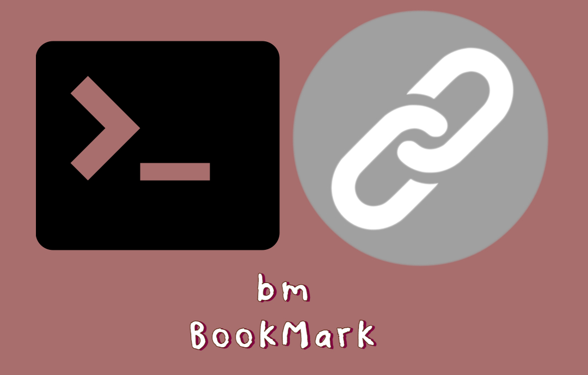

# bm



**bm** comes from **Bookmark** as a short name. bm is a CLI tool for saving links on terminal easily. It has different features like adding new link, listing them, creating and saving under categories, deleting links or categories. 

## Motivation

I always use terminal while making development. It stays open everytime. I compile, run, test the code or commiting the changes on GitHub on the terminal. In short, I try to do all my jobs while coding on the terminal. Again, due to my personal characteristics, I want to control my jobs from one place if it is possible. I mean I do not like to work with lots of different windows and tools. I try to manage all stuff from one or two applications/tools. I know there are different tools or ways to manage bookmarks, but I do not like using any other tools/applications except the necessary ones like IDE, terminal. That's why I wanted to build a CLI tool that manages the bookmarks. Also, the minor motivation was applying the **Bash** knowledge to real-world project. 

## Example

```shell
$ ./bm setup    # prepares the environment
$ ./bm --help   # shows the usage
$ ./bm add www.github.com Software CS   # Saves the link on "Software" and "CS" categories
$ ./bm add --category Software CS Reading Videos    # Adds new categories 
$ ./bm list --category  # lists all categories
$ ./bm list --category CS   # lists all bookmarks under given category
$ ./bm list -c CS Reading Videos    # lists all bookmarks under given categories
$ ./bm remove Reading Videos    # Remove the given categories
$ ./bm remove --force Reading Videos    # Remove the given categories even if they are not empty
$ ./bm delete 1 3 4     # Delete the given bookmark ids in default category, bm
$ ./bm delete -c Reading 1 4 5  # Delete the given bookmark ids by given category
```

# LICENSE

[MIT](./LICENSE)